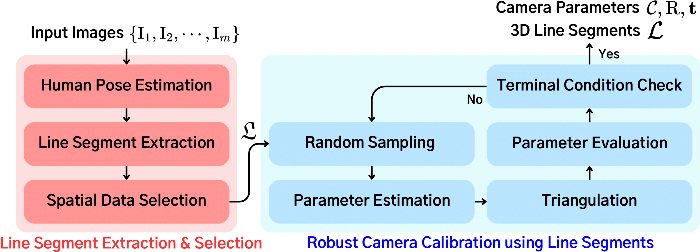
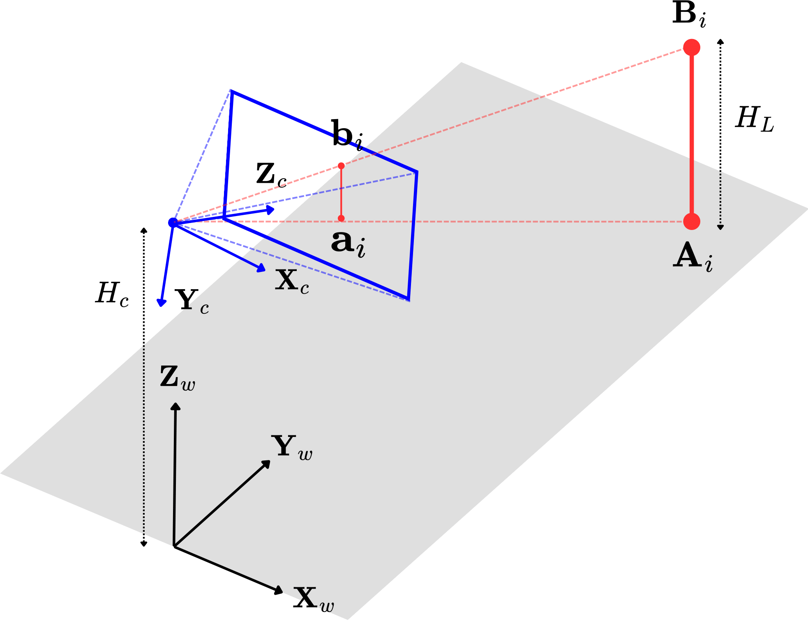

# Pedestrian-based Camera Calibration Toolbox

The **Pedestrian-based Camera Calibration Toolbox** is a Python-based tool designed to automatically calibrate cameras using pedestrian joint information. It leverages YOLO-based pose tracking and RANSAC-based calibration techniques to compute intrinsic and extrinsic camera parameters from input videos.

---

## Prerequisite

To use this project, the following libraries need to be installed.

### **Required Libraries**
- `numpy`
- `opencv-python`
- `scipy`
- `matplotlib`
- `ultralytics` (YOLO11 model)
- `lap`

### **Installation**
Run the following command to install the necessary libraries:
```bash
pip install numpy opencv-python scipy matplotlib ultralytics lap
```

### **Make Data Folder**
Make data folder and put your input video `input.avi`.
```bash 
mkdir data 
```

---

---



### **main.py**
- **Purpose:** Processes the extracted data to compute the camera's intrinsic and extrinsic parameters, and saves the calibration results.
- **Workflow:**
  1. **Data Extraction:** Use `calib_extract_data.py` to generate JSON data.
  2. **Data Loading:** Load the extracted JSON data for calibration.
  3. **Data Sampling:** Use `SpatialSampler` to refine the dataset. This sampler ensures line segments occupy one portion of grid.
  4. **Initial Calibration (MSAC):** Estimate camera parameters using the MSAC algorithm (a variant of RANSAC).
  5. **Optimization (Bundle Adjustment):** Refine the results for higher accuracy.
  6. **Save Results:** Save the camera’s rotation matrix, translation vector, intrinsic matrix, and distortion coefficients to text files.
- **How to Run:**
  ```bash
  python main.py
  ```

---

## Data File Structure

The output files generated during the execution are structured as follows:

### **1. data/data.json**
Contains extracted pedestrian data:
- `a`: Bottom positions.
- `b`: Head positions.
- `l`: Pedestrian upper body length.
- `cam_w`: Camera resolution (width).
- `cam_h`: Camera resolution (height).

### **2. data/calibration.txt**
Contains camera calibration results:
- `RotationMatrices`: Camera rotation matrix.
- `TranslationVectors`: Camera translation vector.
- `IntrinsicMatrix`: Camera intrinsic parameters (focal length, optical center).

### **3. data/dist_coef.txt**
Contains lens distortion coefficients:
- `Distortion`: Distortion coefficient values.

---

## Example Workflow

### **Perform Calibration**
1. Run `main.py`:
   ```bash
   python main.py
   ```
   After execution, the calibration results will be saved in `data/calibration.txt` and `data/dist_coef.txt`.


### **Calibration results** 
2. `calibration.txt` and `dist_coef.txt`
    Camera calibration results follows geometric structure and notations that below.

    (1) Gemoetrical overview

    
    (2) Equations 
      $$
      \begin{aligned}
        \mathrm{K} &=\begin{bmatrix}
                          f & 0 &  cx \\
                          0 &  f & cy \\
                          0 & 0 & 1 
                    \end{bmatrix} \\

        \mathrm{R} &= \mathrm{R}_z(\phi) \mathrm{R}_x(\theta) \\
                    &= \begin{bmatrix}
                          \cos \phi & -\cos \theta \sin \phi &  \sin \theta \sin \phi \\
                          \sin \phi &  \cos \theta \cos \phi & -\sin \theta \cos \phi \\
                          0 & \sin \theta & \cos \theta \end{bmatrix} \\
                    &= \begin{bmatrix} \mathbf{r_1} & \mathbf{r_2} & \mathbf{r_3} \end{bmatrix} \\

        \mathbf{t} &= -\mathrm{R} \begin{bmatrix} 0 \\ 0 \\ H_c \end{bmatrix} = -H_c \mathbf{r}_3 
      \end{aligned}
      $$
---
### Improvements 


---
## Notes
- **YOLO Model:** The `yolo11n-pose.pt` model is required and can be downloaded from [Ultralytics YOLO](https://github.com/ultralytics/ultralytics).
- **Input Video:** Ensure your input video is available at `data/input.avi`.
- **Output Directory:** All results will be saved in the `data/` directory. Ensure the directory exists before running the scripts.

---

## References
- [OpenCV Documentation](https://docs.opencv.org/)
- [Ultralytics YOLO](https://github.com/ultralytics/ultralytics)